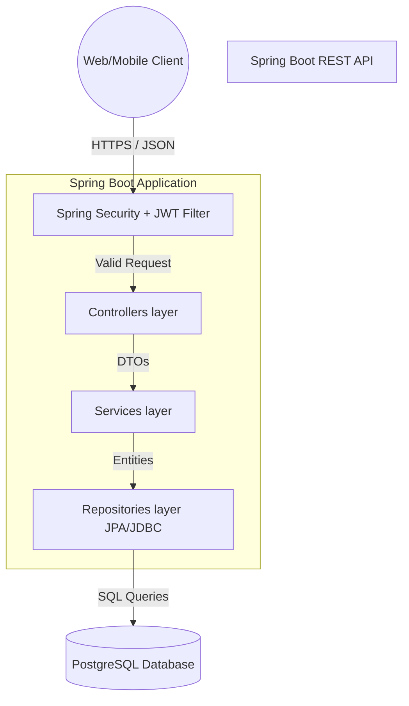
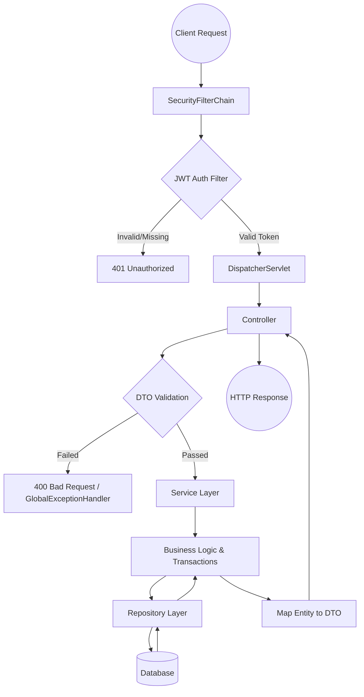
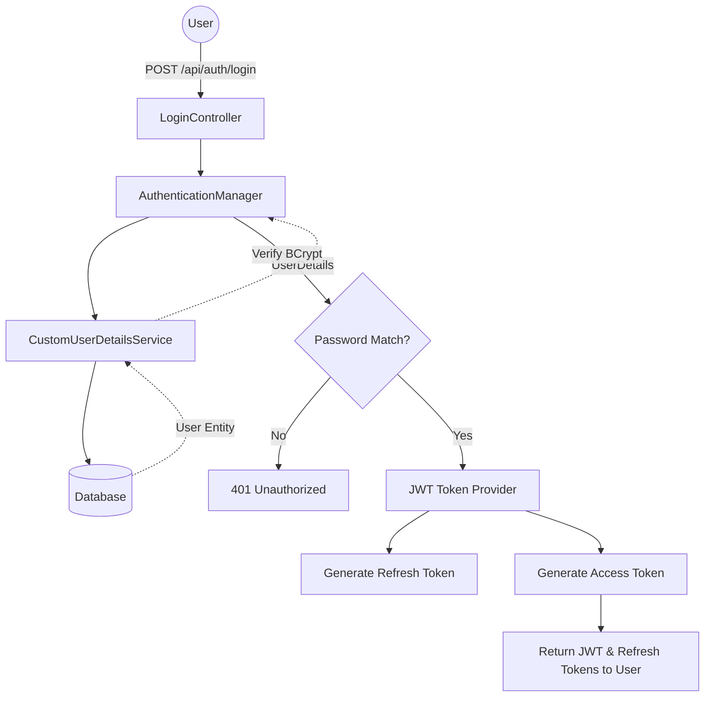
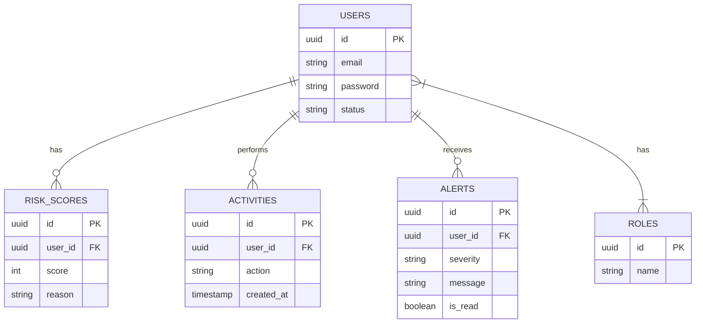
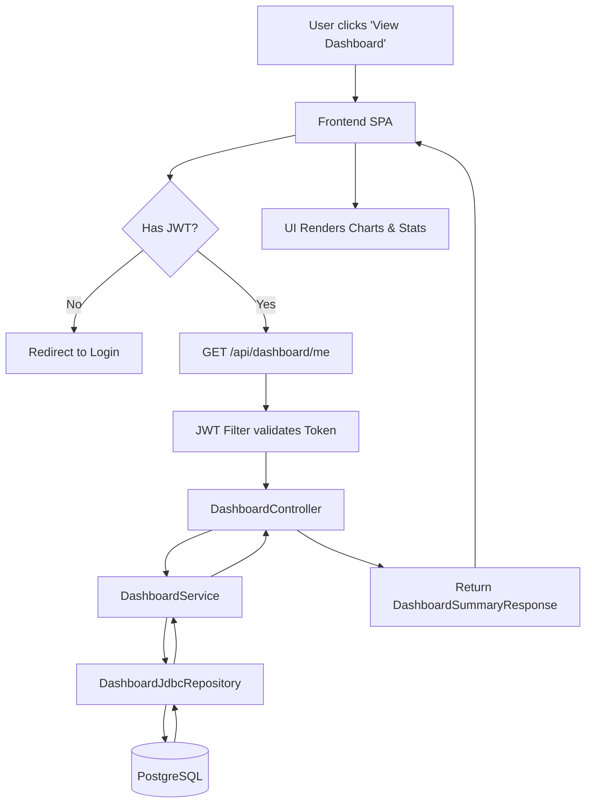

# Full Architecture Summary

Sentinel-X is a robust, modular **RESTful API** built using **Java 17** and **Spring Boot 3**. The architecture follows a classic **Layered Monolith** (or N-Tier) design pattern. This approach cleanly separates concerns into controllers (presentation layer), services (business logic), and repositories (data access).

### Technology Stack
* **Language:** Java 17
* **Framework:** Spring Boot 3.5.x
* **Database:** PostgreSQL (with H2 for testing)
* **Migrations:** Flyway
* **Security:** Spring Security & JWT (JSON Web Tokens)
* **Build Tool:** Maven

### Key Architectural Patterns
* **Controller-Service-Repository (Layered Architecture):** Ensures separation of concerns. Controllers handle HTTP, Services handle logic, Repositories handle database operations.
* **Dependency Injection (DI):** Spring's core IoC (Inversion of Control) container manages object lifecycles and injects dependencies via constructors.
* **Strategy Pattern:** Used specifically in the `risk` module (e.g., `RiskScoringStrategy`) to allow different algorithms for calculating risk without changing the core service code.
* **DTO Pattern (Data Transfer Objects):** Separates database entities from API payloads, preventing over-posting and accidental data leaks.

---

# Key Modules and Responsibilities

| Module | Core Responsibility |
| :--- | :--- |
| **Auth (`com.sentinelx.auth`)** | Manages authentication, JWT token generation/validation, password resets, email verification, and role-based access control. |
| **User (`com.sentinelx.user`)** | Manages user lifecycles, user profiles, status, and role assignments. |
| **Risk (`com.sentinelx.risk`)** | Calculates and persists dynamic risk scores for users or system actions using pluggable strategies. |
| **Alert (`com.sentinelx.alert`)** | Manages notifications/alerts triggered by high-risk actions. |
| **Activity (`com.sentinelx.activity`)** | Tracks and audits user activities and system events. |
| **Dashboard (`com.sentinelx.dashboard`)** | Provides aggregated analytics, statistics, and risk trend metrics using raw JDBC queries for performance. |
| **Config (`com.sentinelx.config`)** | Holds core application configuration (Security, SSL, Startup Validation, Transactions). |
| **Common/Exception** | Global error handling (ControllerAdvice), health checks, and retryable service utilities. |

---

# Flowcharts

## 1. High-Level Architecture

## 2. Backend Request Lifecycle

## 3. Authentication Flow

## 4. Database Relationships (Core Entities)

## 5. Client Interaction Flow (End-to-End)

---

# Security Review

Sentinel-X enforces security primarily via **Spring Security** and **JWT (JSON Web Tokens)**.

* **Stateless Sessions:** The server stores no session data `SessionCreationPolicy.STATELESS`. Every authenticated request must carry a `Bearer` token in the `Authorization` header.
* **Role-Based Access Control (RBAC):** Endpoints are protected by annotations (e.g., `@PreAuthorize("hasAuthority('ADMIN')")`) or in the `SecurityConfig` chain. Roles include `ADMIN`, `ANALYST`, and generic authenticated users.
* **Password Hashing:** Passwords are never stored in plaintext. `BCryptPasswordEncoder` is used before writing to the database.
* **Exception Handling:** A `@RestControllerAdvice` globally captures exceptions (e.g., `ResourceNotFoundException`, `AccessDeniedException`) preventing stack traces from leaking to the client.

# Performance Notes

* **JDBC for Analytics:** The `Dashboard` module deliberately bypasses Hibernate (JPA) and uses pure JDBC (`DashboardJdbcRepository`). This prevents Hibernate from loading thousands of entities into memory just to calculate a `COUNT(*)` or an average.
* **Database Indexing:** Flyway migrations include indexes on frequently queried columns (e.g., `user_id` on activities and alerts) to maintain read performance as tables grow.
* **Statelessness:** The use of JWT means the backend can be horizontally scaled easily without needing sticky sessions or distributed session storage (like Redis).

# Beginner Learning Roadmap

If you are a beginner trying to learn this codebase, follow this order:

1. **Entities & Database:** Start by looking at `src/main/resources/db/migration/V1__init.sql` and the `com.sentinelx.user.entity` package. Understand how tables map to Java classes.
2. **Repositories:** Look at `UserRepository`. See how Spring Data JPA magic works (you declare an interface, Spring writes the SQL).
3. **Services:** Look at `UserService`. This is where the actual business rules live.
4. **Controllers & DTOs:** Look at `UserController` and the `dto` package. See how external JSON is converted to DTOs, validated, and passed to the Service.
5. **Security:** Finally, look at `SecurityConfig` and `JwtAuthenticationFilter` to understand how the doors are locked.
