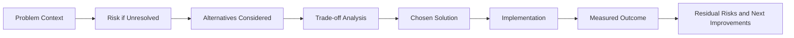
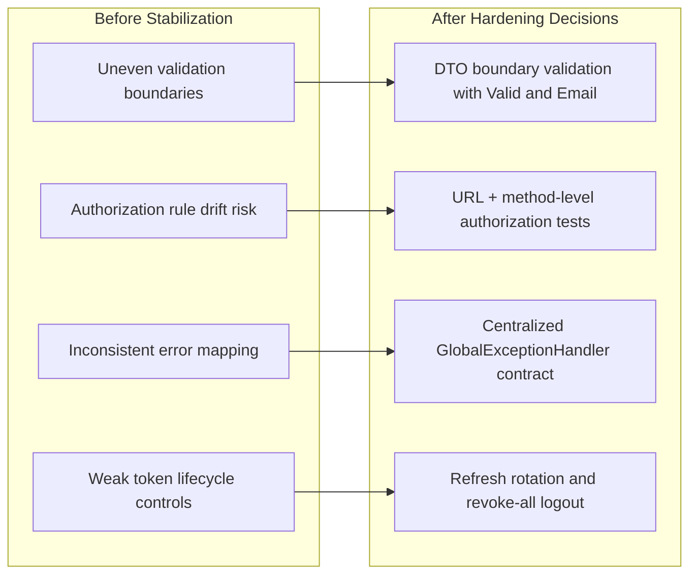

# Problem and Solution Log

## Purpose

This document captures the major backend engineering problems encountered during SentinelX development, why each was a real problem in production terms, which alternatives were considered, why a specific solution was selected, and what outcome was achieved.

The goal is to preserve decision quality over time, not just implementation history.

## Decision Flow Diagram

## Before vs After Architecture and Decision Impact

## 1) Access Control Drift Between URL Rules and Endpoint Intent

### Context

The project uses both URL-level security rules in SecurityConfig and method-level rules with PreAuthorize in controllers. During rapid feature growth, it is common for these two layers to drift.

### Problem

Without explicit alignment, users could face one of two failures:

- Legitimate requests blocked by too-restrictive URL rules.
- Sensitive routes accidentally reachable due to broad URL patterns.

### Alternatives Considered

1. Rely only on URL matcher rules.
2. Rely only on method-level annotations.
3. Keep both layers and verify with explicit authorization tests.

### Chosen Solution

Option 3 was adopted:

- URL rules enforce broad request perimeter.
- PreAuthorize enforces endpoint intent and role semantics.
- AuthorizationRulesTest and controller tests verify role-based behavior for employee, analyst, and admin paths.

### Why This Was Chosen

Dual-layer checks reduce single-point misconfiguration risk. If one layer regresses, the other still provides protection.

### Outcome

The API now enforces expected behavior such as:

- Employee restricted to own resources for sensitive modules.
- Analyst access to cross-user read paths.
- Admin-only operations protected at both policy layers.

Residual risk: any new endpoint still requires explicit test coverage to prevent silent policy gaps.

## 2) Request Validation Gaps in Authentication DTOs

### Context

Authentication payloads are security-critical and should fail fast on malformed inputs.

### Problem

Email fields in auth request DTOs were previously validated for presence only, not format. This allowed invalid email-like strings to pass into service/authentication logic.

### Alternatives Considered

1. Accept loose input and rely on service-level checks.
2. Add custom validators in service methods.
3. Add Jakarta validation annotations directly on DTO fields.

### Chosen Solution

Option 3:

- Added Email annotation for auth email fields.
- Kept validation boundary at controller layer with Valid.

### Why This Was Chosen

Validation belongs at request boundary where it is deterministic, reusable, and consistent with other DTO constraints.

### Outcome

Malformed email payloads now fail with HTTP 400 and a stable error envelope from GlobalExceptionHandler.

## 3) Path Variable Type Mismatch Returned Wrong Class of Error

### Context

Several endpoints use numeric path variables (for example, userId and id). Invalid path value types can otherwise bubble as framework exceptions.

### Problem

Type mismatch conditions can unintentionally surface as generic server errors if not explicitly translated.

### Alternatives Considered

1. Accept default framework behavior.
2. Add per-controller exception handling.
3. Add centralized handler for MethodArgumentTypeMismatchException.

### Chosen Solution

Option 3 in GlobalExceptionHandler:

- Map type mismatch to 400 with deterministic message.

### Why This Was Chosen

Centralized mapping avoids repeated controller code and guarantees contract consistency across modules.

### Outcome

Invalid typed path/query inputs now return explicit 400 responses instead of ambiguous failures.

## 4) Refresh Token Replay and Session Revocation Semantics

### Context

Access tokens are short-lived JWTs and refresh tokens are persisted in database.

### Problem

Without rotation and revocation strategy, stolen refresh tokens remain useful for long periods and logout semantics are weak.

### Alternatives Considered

1. Stateless refresh token design with no persistence.
2. Persistent tokens but no rotation.
3. Persistent tokens with rotation and revocation flag.

### Chosen Solution

Option 3 implemented in RefreshTokenService:

- Refresh tokens stored with expiry_date and revoked fields.
- rotateRefreshToken revokes old token and issues new one.
- logout revokes all tokens for current user.

### Why This Was Chosen

Provides revocation control while keeping implementation complexity manageable in a monolith.

### Outcome

Token lifecycle is materially safer. Replay window is reduced via rotation, and user logout invalidates server-side token state.

Planned improvement: introduce distributed revocation cache for multi-instance deployments.

## 5) Email Verification and Password Reset Lifecycle Safety

### Context

Security workflows need token expiration, one-time semantics, and anti-enumeration behavior.

### Problem

If reset and verification tokens are not one-time and expiring, credential takeover risk increases.

### Alternatives Considered

1. Short links with no DB persistence.
2. Persist tokens but no used flag.
3. Persist tokens with expiry and used state.

### Chosen Solution

Option 3:

- Verification and reset tokens persisted.
- Expiry windows enforced.
- used flag enforced to block replay.
- forgot-password is silent for unknown email to reduce account enumeration.

### Why This Was Chosen

Balances security and implementation simplicity while remaining testable.

### Outcome

Token misuse scenarios are blocked and verified through dedicated service tests.

Current limitation: development profile uses log-based email service rather than external provider.

## 6) Alert State Machine Integrity

### Context

Alert workflow has operational meaning (open, under investigation, acknowledged, resolved).

### Problem

Allowing arbitrary transitions can create invalid operational states and break analyst workflows.

### Alternatives Considered

1. No transition validation.
2. Controller-level transition checks.
3. Service-level explicit transition guard.

### Chosen Solution

Option 3 in AlertService with validateStatusTransition.

### Why This Was Chosen

Business state rules belong in service layer where every write path can be controlled.

### Outcome

Illegal transitions return conflict responses. Legitimate lifecycle updates are deterministic and auditable.

## 7) Employee Scope Enforcement for Own-Data Endpoints

### Context

Employee role should access only own records while analyst/admin can access broader scopes.

### Problem

Simple role checks are insufficient for ownership constraints.

### Alternatives Considered

1. Separate endpoints by role.
2. Controller-level ownership checks per endpoint.
3. Ownership in data repository queries only.

### Chosen Solution

A mixed practical approach:

- Endpoint role checks via PreAuthorize.
- Ownership checks in controller/service logic for employee paths.

### Why This Was Chosen

Provides explicit behavior in request flow while preserving readability.

### Outcome

Unauthorized cross-user employee access is blocked and covered by tests in risk/activity/user/alert controllers.

## 8) Schema Evolution Discipline

### Context

Project schema evolved from V1 to V9 with added auth and security features.

### Problem

Schema drift is likely when changing entities during active feature development.

### Alternatives Considered

1. Hibernate auto-update in development and production.
2. Manual SQL docs only.
3. Flyway-managed immutable migrations plus hibernate ddl validation.

### Chosen Solution

Option 3:

- Flyway for all schema changes.
- versioned migration files.
- hibernate ddl-auto set to validate.

### Why This Was Chosen

Predictable migration history, safer production promotion, and deterministic rollback planning.

### Outcome

Schema is reproducible and aligned with code expectations.

Rule enforced: never edit already-applied migration; create new versioned migration instead.

## 9) Startup Reliability for Role Data

### Context

Authorization assumes default roles exist.

### Problem

Fresh environment bootstrap can fail or produce runtime authorization anomalies without role seed data.

### Alternatives Considered

1. Manual SQL pre-seed outside application.
2. One-time startup script.
3. Idempotent application startup seeding.

### Chosen Solution

Option 3 through SeedDataRunner and RoleService.ensureDefaultRoles.

### Why This Was Chosen

Self-healing startup behavior and fewer environment-specific manual steps.

### Outcome

ADMIN, ANALYST, EMPLOYEE roles are consistently available across local and test runs.

## 10) Error Contract Consistency Across Modules

### Context

Frontend and API consumers need stable error contracts independent of module.

### Problem

Mixed exception handling patterns create inconsistent status codes and bodies.

### Alternatives Considered

1. Controller-specific handling.
2. Generic fallback only.
3. Centralized typed mappings plus generic fallback.

### Chosen Solution

Option 3 via GlobalExceptionHandler:

- typed 400, 401, 403, 404, 409 mappings.
- normalized error shape with timestamp, status, error.

### Why This Was Chosen

Improves API predictability and simplifies client error handling.

### Outcome

Cross-module error behavior is now coherent and regression-testable.

## Trade-off Summary

- Chosen design prefers explicit service and controller checks over highly abstract policy engines.
- This improves readability and onboarding speed but can increase code repetition.
- Current architecture is appropriate for a modular monolith and can be evolved to stronger policy centralization if role rules become significantly more complex.

## Overall Development Outcome

The backend matured from baseline feature implementation to production-aligned behavior with:

- stricter input validation,
- deterministic security enforcement,
- robust token lifecycle handling,
- migration-safe schema evolution,
- consistent error contracts,
- and broad automated test confidence.
