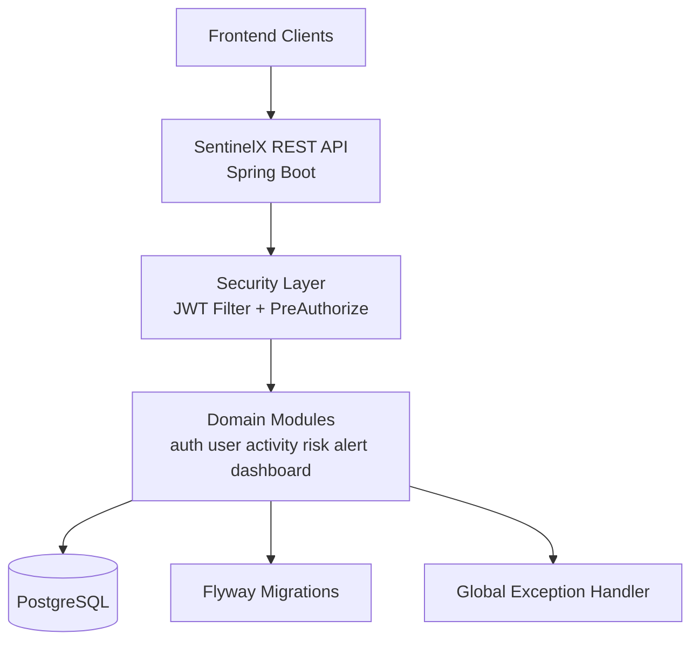
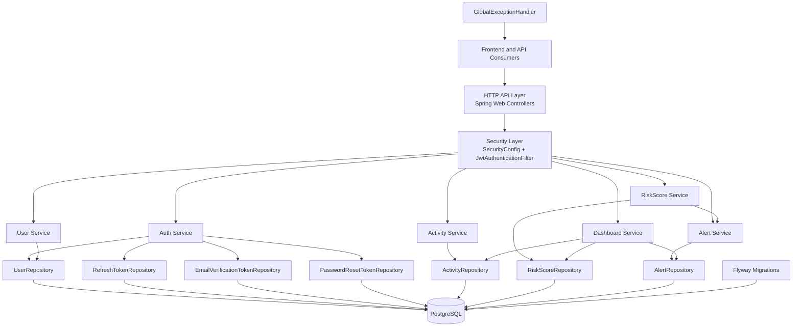
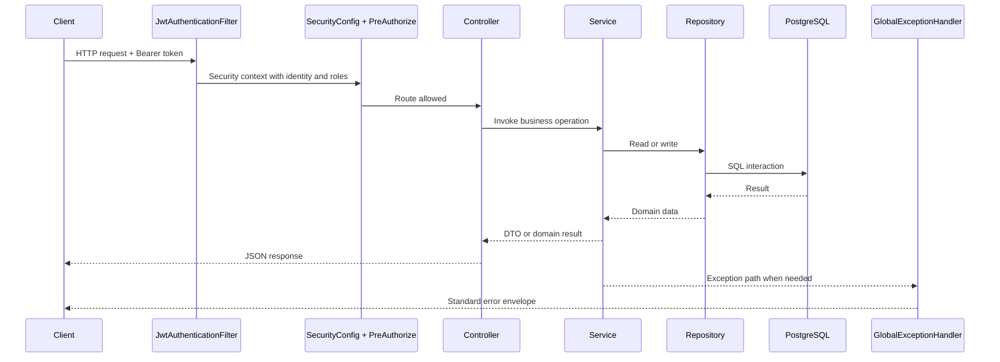
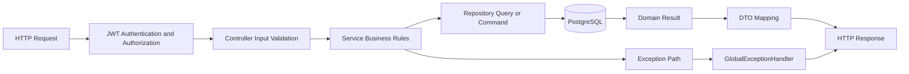
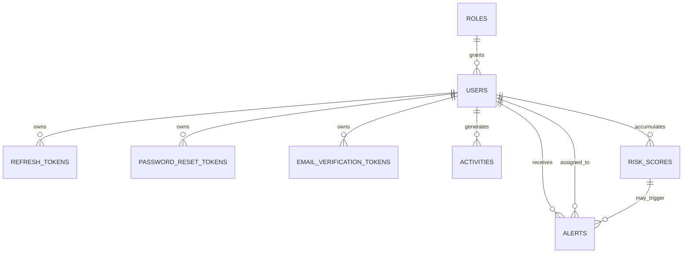
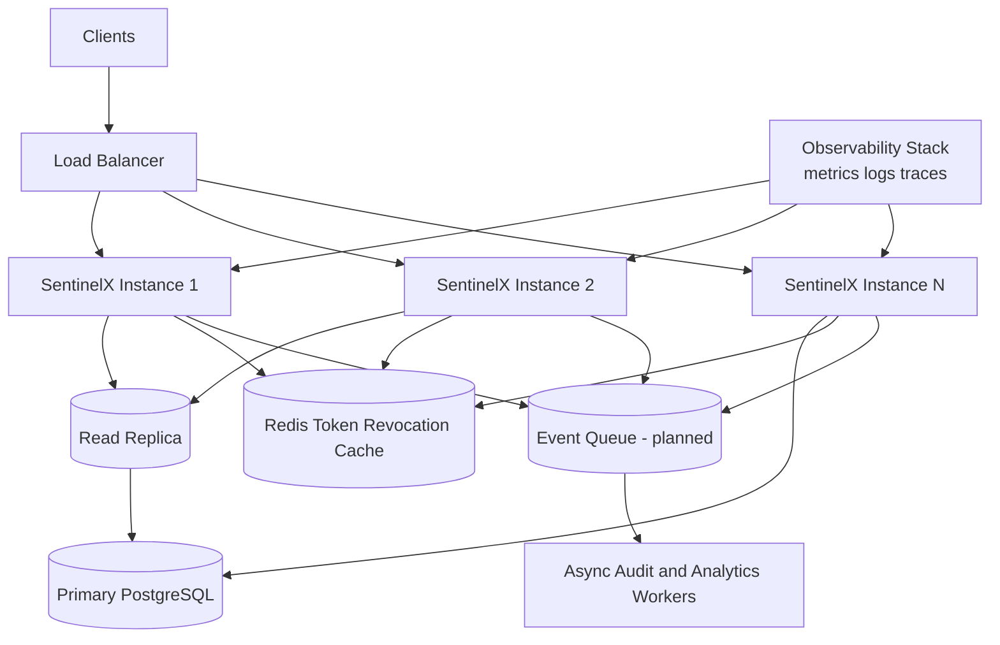

# System Architecture Deep Dive

## 1. Architecture Overview

SentinelX backend is a modular monolith built on Spring Boot 3 with Java 17. It exposes REST endpoints for authentication, user management, activity logging, risk scoring, alert lifecycle management, dashboard analytics, and health monitoring.

The design intentionally favors clear module boundaries and strict contracts over premature microservice decomposition.

### Architecture Context Diagram

### Detailed System Architecture Diagram

## 2. Design Principles Used

### Domain-Oriented Modularization

Modules are separated by business capability:

- auth
- user
- activity
- risk
- alert
- dashboard
- common
- config
- exception

Each module follows a consistent layered structure:

- controller for HTTP contract and authorization boundaries
- service for business logic and orchestration
- repository for persistence access
- entity for data model
- dto for external contract shape

### Separation of Concerns

Security concerns are centralized in SecurityConfig and JwtAuthenticationFilter.

Error response normalization is centralized in GlobalExceptionHandler.

Database lifecycle is centralized through Flyway migrations with immutable versioning.

### Practical Consistency

Even where per-module behavior differs, common patterns remain consistent:

- Valid annotation for request DTO validation
- ResponseEntity or typed response records
- Role checks with PreAuthorize
- transactional boundaries around write operations

## 3. Runtime Request Flow

## 3.1 Authenticated Request Sequence

1. Client sends Authorization header with Bearer token.
2. JwtAuthenticationFilter extracts and validates token.
3. Username and role claims are materialized into security context.
4. URL-level security rules in SecurityConfig allow or reject request.
5. Controller-level PreAuthorize checks enforce endpoint intent.
6. Controller delegates to service for domain logic.
7. Service accesses repositories and applies business rules.
8. DTOs are returned as API payloads.
9. Exceptions are normalized by GlobalExceptionHandler.

### Authenticated Request Flow Diagram

### End-to-End Data Flow Diagram

## 3.2 Public Request Sequence

Public endpoints (register, login, refresh, verify-email, forgot/reset password, health) bypass authenticated route requirements but still pass through validation and exception normalization.

## 4. Security Architecture

## 4.1 Perimeter Security

SecurityConfig applies:

- stateless sessions
- csrf disabled for token-based API usage
- custom authentication entry point for 401
- JWT filter before username/password filter

URL-level matcher strategy defines broad access classes (public vs authenticated vs role-scoped).

## 4.2 Method-Level Authorization

Controller methods use PreAuthorize to protect endpoint behavior at finer granularity, including mixed role and ownership patterns.

Ownership checks are enforced in selected controller/service flows for employee-only self-access behavior.

## 4.3 Identity and Credentials

- Passwords are stored as BCrypt hashes.
- UserDetails loads by username or email.
- Role constants map to ROLE_ADMIN, ROLE_ANALYST, ROLE_EMPLOYEE.

## 4.4 Token Model

Access token:

- JWT with username subject and roles claim.
- Lifetime controlled by jwt.expiration-ms.

Refresh token:

- Stored in refresh_tokens table.
- Has expiry and revoked state.
- Rotation revokes old token and creates new token.
- Logout revokes all tokens for a user.

## 5. Data Architecture

## 5.1 Persistence Model

Core relational entities:

- roles
- users
- refresh_tokens
- password_reset_tokens
- email_verification_tokens
- activities
- risk_scores
- alerts

Relational links enforce integrity, for example:

- users -> roles
- token tables -> users
- risk_scores -> users
- alerts -> users and optional risk_score and assignee user

### Data Relationship Diagram

## 5.2 Migration Strategy

Flyway owns schema evolution with V1 through V9 migration files.

Key safety control:

- spring.jpa.hibernate.ddl-auto=validate prevents implicit schema mutation.

## 5.3 Query and Aggregation Patterns

- Transactional read methods use pageable repository queries for potentially large datasets.
- Dashboard uses aggregate queries and grouped counts for operational metrics.
- Risk and alert modules compute and persist state transitions, not just transient responses.

## 6. Module Interaction Map

## 6.1 Auth Module

Primary responsibilities:

- registration
- login
- token issuance
- token refresh and logout
- password reset
- email verification

Dependencies:

- user module for identity persistence
- refresh token module for session lifecycle
- jwt module for token creation/validation
- email service abstraction for notification triggers

## 6.2 User Module

Primary responsibilities:

- user CRUD
- role assignment on creation
- account status updates

Interactions:

- emits verification trigger on user creation
- consumed by most modules for identity resolution

## 6.3 Activity Module

Primary responsibilities:

- activity write logging
- user/entity filtered read APIs

Interactions:

- consumed by risk scoring and dashboard recent activity views

## 6.4 Risk Module

Primary responsibilities:

- compute score using strategy
- persist risk score history
- return latest/history APIs

Interactions:

- consumes activity streams
- triggers alert generation above configured threshold

## 6.5 Alert Module

Primary responsibilities:

- generate alerts from risk events
- status lifecycle operations
- assignment and deletion controls

Interactions:

- linked with risk record context
- surfaced in dashboard aggregates

## 6.6 Dashboard Module

Primary responsibilities:

- employee summary view
- admin aggregate view
- trends and alert stats

Interactions:

- combines activity, risk, alert, and user aggregates

## 7. Reliability and Robustness Patterns

- Global exception mapping ensures stable error payload shape.
- DTO validation at boundaries reduces unsafe processing paths.
- Transactional write operations preserve data consistency.
- Idempotent role seeding prevents bootstrap drift.
- Explicit status transition guards preserve alert lifecycle integrity.
- Ownership checks prevent data leakage for employee role paths.

## 8. Why This Architecture Is Practical for SentinelX

- Domain modules align with real product capabilities.
- Monolith deployment keeps operational overhead low for current scale.
- Clear extension points already exist (strategy pattern, service boundaries, repository abstractions).
- Security and data controls are mature enough for controlled growth without replatforming.

## 9. Scalability and Improvement Roadmap

### Future Scaling Architecture Diagram

## 9.1 Near-Term Improvements

1. Add structured audit logging with correlation ids.
2. Add rate limiting for auth-sensitive endpoints.
3. Enforce email_verified at login policy layer.
4. Improve validation error payloads with field-level details.
5. Add OpenAPI generation for contract discoverability.

## 9.2 Performance and Data Scale Enhancements

1. Expand index strategy for high-volume activity and alert filtering patterns.
2. Add archival policy for old activity and risk records.
3. Introduce caching for dashboard aggregate reads where acceptable.
4. Add query observability metrics (latency, row counts, plan drift).

## 9.3 Session and Security Hardening

1. Move refresh token revocation checks to Redis-backed distributed store for horizontal scale.
2. Add token device fingerprinting and anomaly checks.
3. Add security event stream for suspicious auth behavior.

## 9.4 Architectural Evolution Paths

When product and team scale justify decomposition:

- split dashboard aggregation into read-optimized service first
- split auth/token service second if traffic profile dominates
- keep user identity as source-of-truth module and avoid duplicate ownership

A staged decomposition is safer than immediate microservice migration.

## 10. Architecture Risks to Monitor

- Authorization complexity growth can increase rule drift risk unless test coverage evolves.
- Alert and risk write amplification may stress single-node database at high event throughput.
- Operational maturity (observability, rate limits, incident diagnostics) should grow with production usage.

## 11. Current Architecture Confidence

Given the existing security tests, controller coverage, service tests, and E2E flows, the current architecture is reliable for present scope and is structured to support incremental hardening and scale improvements without disruptive rewrites.
