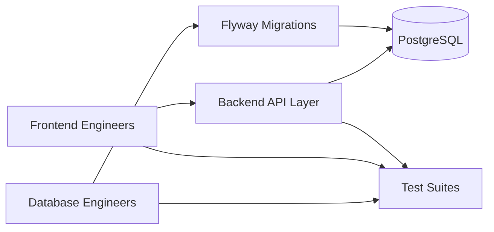
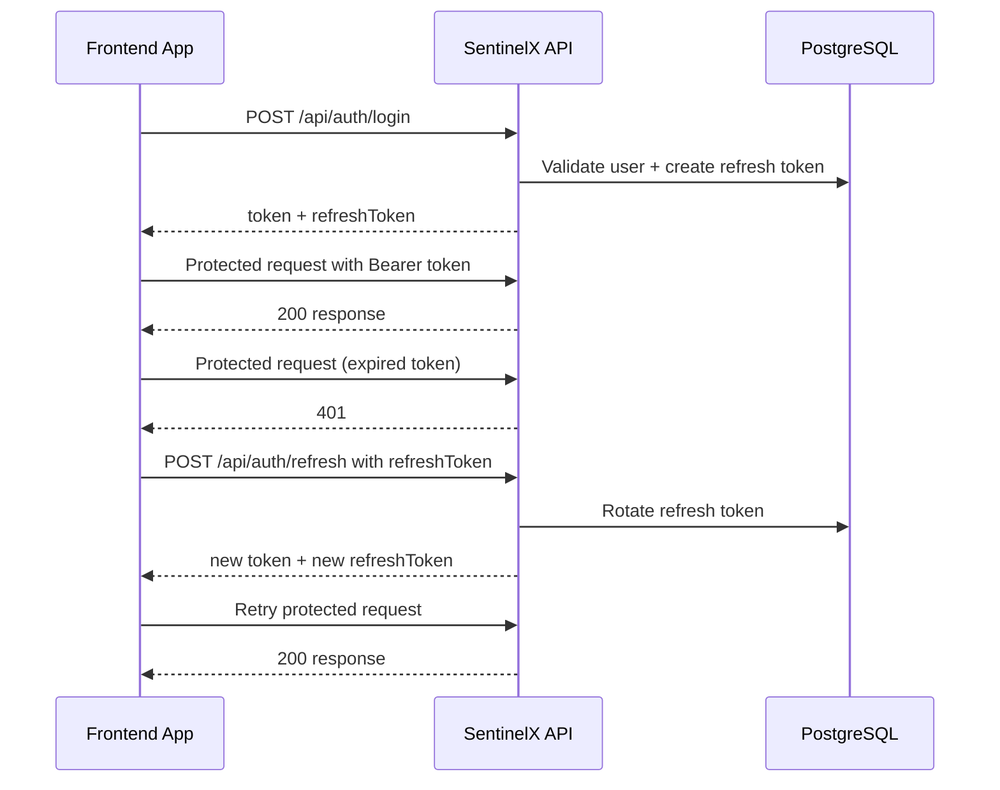
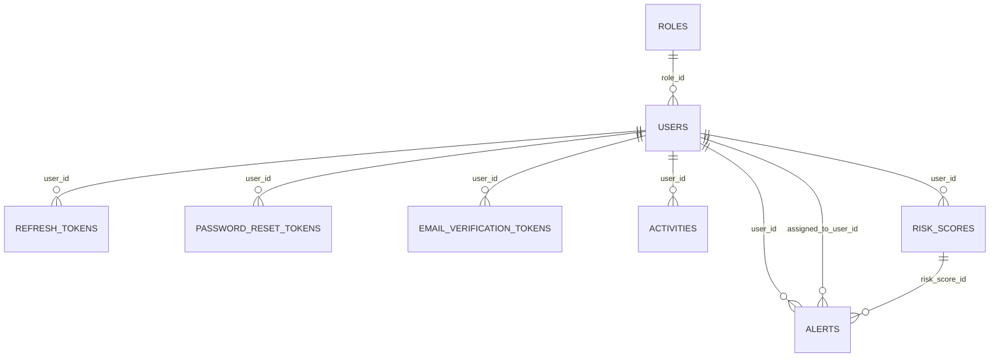
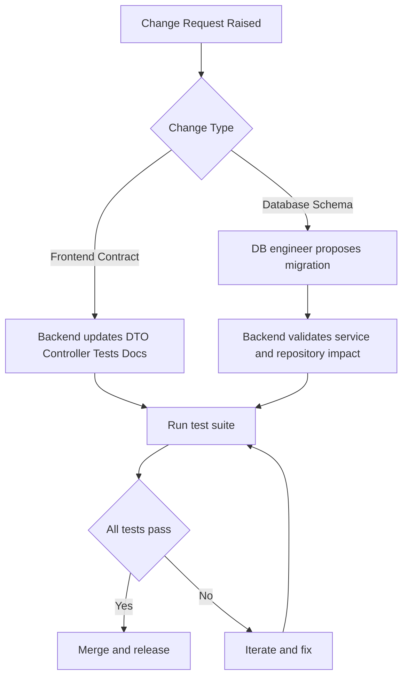

# Integration Guide for Frontend and Database Engineers

## Audience and Goal

This guide is for frontend engineers integrating API consumers and database engineers maintaining data correctness, performance, and migration safety.

Use this document to become productive quickly without reverse-engineering backend internals.

## System Integration Topology



## Component Interaction Diagram

```mermaid
flowchart LR
  FE[Frontend UI] --> AUTHAPI[/api/auth/*]
  FE --> USERAPI[/api/users/*]
  FE --> ACTAPI[/api/activities/*]
  FE --> RISKAPI[/api/risk/*]
  FE --> ALERTAPI[/api/alerts/*]
  FE --> DASHAPI[/api/dashboard/*]

  AUTHAPI --> AUTHS[Auth and Token Services]
  USERAPI --> USERS[User Service]
  ACTAPI --> ACTS[Activity Service]
  RISKAPI --> RISKS[Risk Service]
  ALERTAPI --> ALS[Alert Service]
  DASHAPI --> DS[Dashboard Service]

  AUTHS --> DB[(PostgreSQL)]
  USERS --> DB
  ACTS --> DB
  RISKS --> DB
  ALS --> DB
  DS --> DB
```

## 1. Repository Navigation

Top-level structure:

- README.md for full API and operations reference
- backend for application source, configuration, migrations, and tests
- engineering-docs for deep technical references

Backend code map:

- src/main/java/com/sentinelx/auth
- src/main/java/com/sentinelx/user
- src/main/java/com/sentinelx/activity
- src/main/java/com/sentinelx/risk
- src/main/java/com/sentinelx/alert
- src/main/java/com/sentinelx/dashboard
- src/main/java/com/sentinelx/common
- src/main/java/com/sentinelx/config
- src/main/java/com/sentinelx/exception

Data and config map:

- src/main/resources/db/migration
- src/main/resources/application.properties
- src/main/resources/application-dev.properties
- src/main/resources/application-test.properties
- src/main/resources/application-prod.properties
- backend/secrets.local.example.properties

## 2. Local Environment Setup for Integration Work

1. Create backend/secrets.local.properties from example file.
2. Start PostgreSQL 15 instance.
3. Run backend with dev profile.
4. Verify health endpoint before contract testing.

Recommended local backend command:

~~~bash
cd backend
./mvnw.cmd spring-boot:run -Dspring-boot.run.profiles=dev
~~~

## 3. Frontend Integration Contract

## 3.1 Base Transport Rules

- Base URL: http://localhost:8081
- Content-Type: application/json
- Protected routes require Authorization: Bearer access_token

## 3.2 Auth Token Lifecycle You Must Implement

1. Register or login to obtain token and refreshToken.
2. Attach token to protected requests.
3. On 401, call refresh endpoint with refreshToken.
4. Retry original request after successful refresh.
5. If refresh fails with 401, clear session and route to login.
6. On logout, call logout endpoint and clear client token state.

### Frontend Auth Integration Sequence



## 3.3 API Error Handling Contract

Global error response envelope:

~~~json
{
  "timestamp": "2026-04-05T12:00:00Z",
  "status": 400,
  "error": "Validation failed"
}
~~~

Client behavior expectations:

- 400: show validation or input correction feedback.
- 401: trigger refresh flow or re-authentication.
- 403: show access denied and remove disallowed controls.
- 404: show not found state.
- 409: show state conflict messaging (for example, alert transition conflict).
- 500: show generic failure and capture telemetry.

## 3.4 Role-Aware Frontend Routing

- EMPLOYEE: own data views only.
- ANALYST: cross-user operational views, no admin-only routes.
- ADMIN: full management and admin dashboard routes.

Important: enforce role-aware UX in the client, but never assume client-side checks are security controls.

## 4. How to Read and Extend API Contracts Safely

### Step-by-step contract tracing

1. Start from module controller endpoint signature.
2. Inspect request DTO for required fields and validation annotations.
3. Inspect service method for business-rule side effects.
4. Inspect exception paths to understand status outcomes.
5. Confirm with corresponding controller and service tests.

### Change checklist for frontend-facing updates

- Update DTO and validation rules.
- Update README contract section.
- Update controller tests for request/response behavior.
- Update E2E tests if cross-module flow changed.

## 5. Database Engineer Integration Guide

### Data Schema Diagram for FE and DB Engineers



## 5.1 Migration Discipline

All schema changes must be implemented as new Flyway versions under src/main/resources/db/migration.

Rules:

- Never edit historical applied migration files.
- Name files with V{number}__{description}.sql.
- Make migration SQL deterministic and idempotent where needed.

## 5.2 Schema Ownership and Expectations

Core tables and lifecycle:

- users and roles are identity and authorization base.
- token tables implement security workflows.
- activities is append-oriented operational log.
- risk_scores is historical scoring ledger.
- alerts is operational incident record with assignment and lifecycle.

## 5.3 Query and Index Expectations

Current schema includes targeted indexes for key lookups and filtering (token lookup, user foreign keys, activity/risk timestamps, alert status and assignment).

When adding high-volume features, validate index design against real query shapes in repositories and dashboard aggregate paths.

## 5.4 Data Integrity and Constraint Strategy

- Foreign keys maintain entity linkage.
- Enum-like columns should remain aligned with application enum definitions.
- State transitions are enforced in service logic; do not bypass API paths for operational writes without equivalent guardrails.

## 5.5 Production Safety Patterns

- Keep ddl-auto at validate for production safety.
- Run migration scripts in staging before production rollout.
- Monitor migration runtime and lock impact for larger tables.

## 6. Reliability Features FE and DB Teams Should Rely On

- Standardized error envelope from GlobalExceptionHandler.
- Deterministic role enforcement with URL and method-level checks.
- Token revocation and rotation semantics on backend.
- Idempotent startup seeding for baseline role consistency.
- Broad automated test suite covering auth, module contracts, and cross-module flows.

## 7. Operational Collaboration Workflow

## 7.1 Frontend to Backend Change Requests

Provide:

- endpoint and role impact
- exact payload diff
- expected status code behavior
- migration implications if any

Backend response should include:

- DTO and endpoint delta
- error contract impacts
- test updates and compatibility notes

### Change Collaboration Workflow



## 7.2 Database to Backend Change Requests

Provide:

- migration proposal and rationale
- expected lock/performance impact
- rollback strategy
- affected repositories/services

Backend response should include:

- service contract compatibility
- regression test updates
- deployment sequencing notes

## 8. Practical Onboarding Path

Day 1:

- Run backend locally.
- Execute test suite once.
- Read controllers and module README sections.

Day 2:

- Trace one complete flow end-to-end (login -> protected endpoint -> refresh -> logout).
- Trace one data flow (activity -> risk score -> alert generation -> dashboard aggregates).

Day 3:

- Implement a small endpoint enhancement with tests and migration safety checks.

## 9. Robustness and Reliability Posture

Current backend is robust for active development and integration due to:

- strong contract and role tests,
- explicit lifecycle guards,
- migration-first data management,
- and stable error handling conventions.

Known engineering opportunities:

- richer field-level validation error details,
- production email provider integration,
- rate limiting,
- distributed token revocation cache,
- expanded observability instrumentation.

## 10. Quick Reference

- Full backend API reference: README.md
- Migration files: backend/src/main/resources/db/migration
- Security policy: backend/src/main/java/com/sentinelx/config/SecurityConfig.java
- Error mapping: backend/src/main/java/com/sentinelx/exception/GlobalExceptionHandler.java
- End-to-end test anchors: backend/src/test/java/com/sentinelx/e2e
