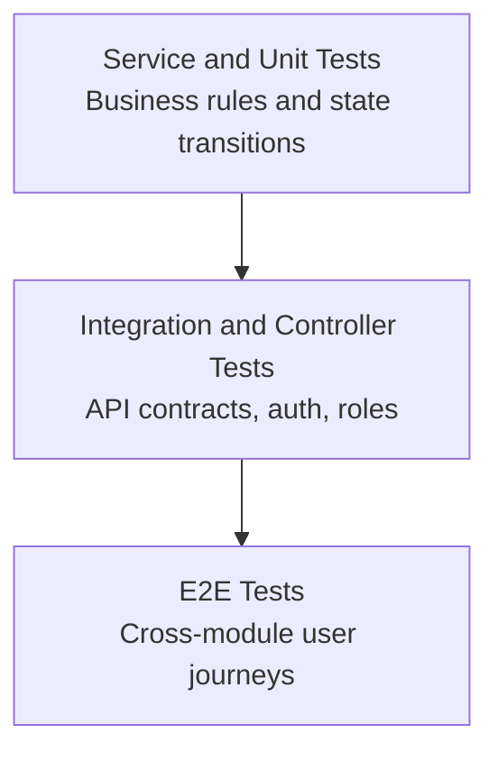
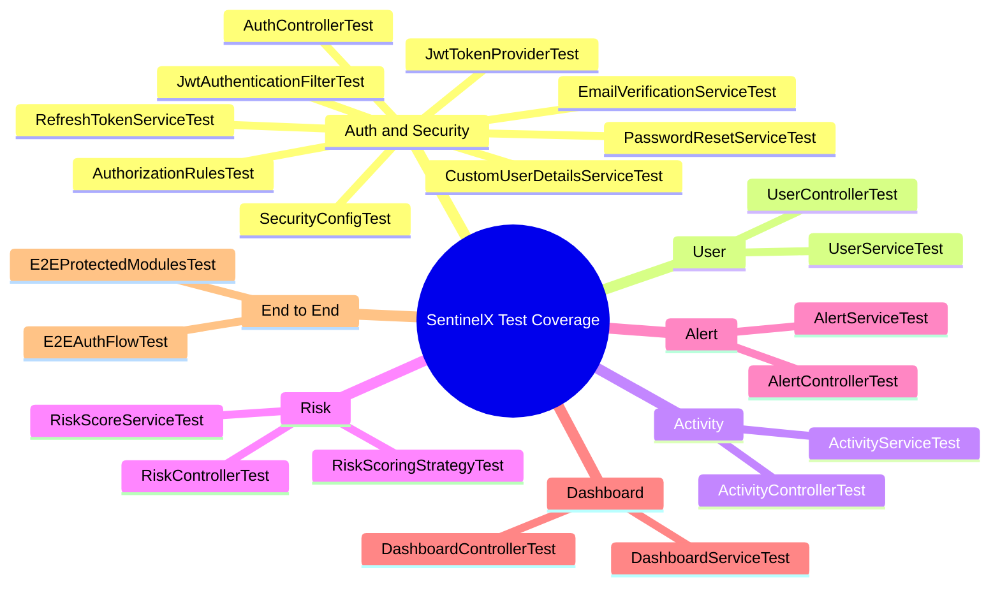
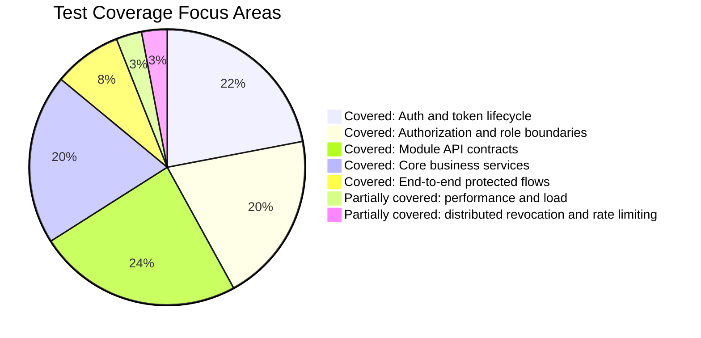

# Testing Strategy and Coverage Report

## 1. Scope and Objective

This report explains the backend testing strategy, what each test suite validates, how tests are executed, the latest observed result, and the confidence level this gives for production readiness.

## 2. Test Pyramid in SentinelX

The project combines multiple test layers to balance speed and confidence:

- Unit and focused service tests for business rules.
- Controller/security integration tests for API contracts and role behavior.
- End-to-end tests for cross-module system behavior.

The combination is intentional:

- lower layers catch logic regressions quickly,
- integration layers verify HTTP and security contracts,
- E2E layers verify critical user journeys across modules.

### Test Pyramid Diagram

## 3. How Tests Are Run

Run full suite:

~~~bash
cd backend
./mvnw.cmd test
~~~

Run a single class:

~~~bash
cd backend
./mvnw.cmd -Dtest=AuthControllerTest test
~~~

## 4. Latest Observed Test Health

Latest full-suite execution summary (from recent backend runs):

- Tests run: 159
- Failures: 0
- Errors: 0
- Build: SUCCESS

Interpretation:

- no known failing assertions,
- no unhandled test exceptions,
- current branch quality is high for covered behaviors.

## 5. Coverage by Test Class and Validated Behavior

## 5.1 Activity Module

### ActivityControllerTest

Validates:

- unauthorized access handling for protected activity endpoints,
- role restrictions for entity/user scoped reads,
- ownership enforcement on get-by-id,
- bad input and unknown-user/id error mapping.

Representative checks:

- getMyActivitiesWithoutTokenReturnsUnauthorized
- getActivitiesByEntityWithAdminTokenReturnsOk
- getActivitiesByUserIdWithInvalidInputReturnsBadRequest
- getActivityByIdWithDifferentEmployeeTokenReturnsForbidden

### ActivityServiceTest

Validates:

- activity persistence correctness,
- filtering by user and entity type,
- not-found exception behavior for unknown ids.

Representative checks:

- logActivitySavesRecordWithCorrectFields
- getActivitiesByUserIdWithUnknownUserIdThrowsResourceNotFoundException

## 5.2 Alert Module

### AlertControllerTest

Validates:

- endpoint authorization per role,
- assignment and deletion policy,
- status update request validation,
- not-found and forbidden pathways.

Representative checks:

- assignAlertByEmployeeReturnsForbidden
- deleteAlertByAdminReturnsNoContent
- updateAlertStatusOpenToResolvedThrowsIllegalTransition

### AlertServiceTest

Validates:

- severity derivation from risk score,
- owner vs non-owner permissions,
- legal and illegal lifecycle transitions,
- assignment/deletion/not-found behavior,
- risk-to-alert trigger coupling.

Representative checks:

- generateAlertCreatesCorrectSeverityForScoreRanges
- updateAlertStatusResolvedToOpenThrowsIllegalTransitionException
- evaluateRiskTriggersAlertCreationWhenScoreExceedsThreshold

## 5.3 Authentication and Security Module

### AuthorizationRulesTest

Validates cross-role policy semantics:

- employee own-resource access,
- employee cross-user denial,
- analyst read-scope behavior,
- admin broad-access behavior.

### AuthControllerTest

Validates HTTP auth flows:

- register and duplicate email handling,
- login success and invalid credential rejection,
- refresh success and failure modes (expired/revoked/nonexistent),
- logout revocation effects,
- request validation errors.

### JwtAuthenticationFilterTest

Validates filter behavior:

- valid token populates security context,
- missing or invalid tokens do not crash request chain.

### JwtTokenProviderTest

Validates token generation and username extraction integrity.

### RefreshTokenServiceTest

Validates token lifecycle logic:

- creation and expiry semantics,
- validation failure modes,
- rotation revokes prior token,
- revoke-all behavior per user.

### CustomUserDetailsServiceTest

Validates user loading and authority resolution, including unknown-user failure mode.

### EmailVerificationServiceTest

Validates:

- verification token creation and email trigger,
- valid verification updates user flag and token usage,
- expired/used/missing token rejection,
- expected default false and post-verify true behavior for emailVerified.

### PasswordResetServiceTest

Validates:

- reset initiation behavior,
- silent handling of unknown email,
- token validity enforcement,
- password update and one-time token usage,
- old password invalidation after reset.

### SecurityConfigTest

Validates perimeter behavior:

- health endpoint is public,
- protected endpoints reject unauthenticated calls,
- valid JWT avoids unauthorized response.

## 5.4 Dashboard Module

### DashboardControllerTest

Validates:

- access control for dashboard endpoints,
- admin-only restrictions,
- response accessibility for employee/analyst/admin scenarios.

### DashboardServiceTest

Validates aggregate correctness:

- user-level counts,
- admin aggregate metrics,
- summary dispatch by role,
- risk trend window constraints,
- alert stats consistency.

## 5.5 Risk Module

### RiskControllerTest

Validates:

- role and ownership constraints,
- unauthorized/forbidden pathways,
- bad input handling,
- unknown user behavior,
- pagination behavior on history endpoints.

### RiskScoreServiceTest

Validates:

- score persistence and retrieval ordering,
- evaluate-on-demand for missing latest score,
- unknown-user handling,
- paged history retrieval correctness.

### RiskScoringStrategyTest

Validates core scoring strategy behavior:

- zero-score baseline for no activity,
- score increase for high-frequency suspicious patterns.

## 5.6 User Module

### UserControllerTest

Validates:

- token-required policy,
- role-based access for user list and admin operations,
- self vs other-user update constraints,
- request validation, not-found, and no-content behavior.

### UserServiceTest

Validates:

- pagination and retrieval semantics,
- duplicate email conflict behavior,
- creation side effects including verification email trigger,
- partial update semantics,
- guarded deletion rules around admin users,
- status update correctness.

## 5.7 End-to-End Tests

### E2EAuthFlowTest

Validates complete auth workflow across real components.

### E2EProtectedModulesTest

Validates protected module interactions under realistic authentication context.

## 5.8 Complete Test Class Matrix

| Module | Test Class | Primary Validation Focus | Representative Method Names |
|---|---|---|---|
| Activity | ActivityControllerTest | Auth, role boundaries, ownership, 400/404 behavior | getMyActivitiesWithoutTokenReturnsUnauthorized, getActivitiesByEntityWithAdminTokenReturnsOk, getActivityByIdWithDifferentEmployeeTokenReturnsForbidden |
| Activity | ActivityServiceTest | Persistence and retrieval semantics | logActivitySavesRecordWithCorrectFields, getActivitiesByEntityReturnsOnlyMatchingEntityType |
| Alert | AlertControllerTest | Route-level authorization and lifecycle endpoints | assignAlertByEmployeeReturnsForbidden, deleteAlertByAdminReturnsNoContent, updateAlertStatusWithInvalidBodyReturnsBadRequest |
| Alert | AlertServiceTest | Severity mapping, transitions, assignment, deletion | generateAlertCreatesCorrectSeverityForScoreRanges, updateAlertStatusResolvedToOpenThrowsIllegalTransitionException |
| Auth and Security | AuthorizationRulesTest | Cross-role policy correctness | employeeAccessingAnotherUsersResourcesReturnsForbidden, adminAccessingEverythingReturnsOk |
| Auth and Security | AuthControllerTest | Register/login/refresh/logout contract behavior | registerWithValidBodyReturnsToken, refreshWithRevokedTokenReturnsUnauthorized, logoutRevokesAllTokensAndSubsequentRefreshReturnsUnauthorized |
| Auth and Security | JwtAuthenticationFilterTest | Security context population and graceful invalid token behavior | requestWithValidTokenSetsSecurityContext, requestWithInvalidTokenPassesWithoutError |
| Auth and Security | JwtTokenProviderTest | Token generation and claim extraction | generatesValidTokenAndExtractsUsername |
| Auth and Security | RefreshTokenServiceTest | Create, validate, rotate, revoke token lifecycle | createRefreshTokenSavesNonNullTokenWithCorrectUserAndFutureExpiry, rotateRefreshTokenRevokesOldTokenAndReturnsNewValidOne |
| Auth and Security | CustomUserDetailsServiceTest | User loading and role authority mapping | loadingExistingUserReturnsCorrectAuthorities, loadingNonExistentUserThrowsUsernameNotFoundException |
| Auth and Security | EmailVerificationServiceTest | Verification token lifecycle and user flag updates | sendVerificationSavesTokenAndCallsEmailService, verifyEmailWithValidTokenMarksUserVerifiedAndTokenUsed |
| Auth and Security | PasswordResetServiceTest | Reset initiation, token validity, password replacement | initiateResetWithUnknownEmailCompletesSilentlyWithoutThrowing, resetPasswordWithValidTokenUpdatesPasswordAndMarksTokenUsed |
| Auth and Security | SecurityConfigTest | Public vs protected route security behavior | healthEndpointIsPublic, protectedEndpointWithoutTokenReturnsUnauthorized |
| Dashboard | DashboardControllerTest | Endpoint role access behavior | getDashboardAdminWithNonAdminReturnsForbidden, getAlertStatsWithAdminTokenReturnsOk |
| Dashboard | DashboardServiceTest | Aggregate computations and role-dispatched summary | getAdminDashboardReturnsCorrectAggregateCounts, getRiskTrendsReturnsEightEntriesMaximum |
| Risk | RiskControllerTest | Role and ownership checks across latest/history endpoints | getRiskByUserIdWithDifferentEmployeeTokenReturnsForbidden, getRiskHistoryByUserIdWithAdminTokenReturnsOkPaginated |
| Risk | RiskScoreServiceTest | Evaluate-on-demand and history retrieval semantics | evaluateRiskSavesScoreRecord, getLatestRiskScoreByUserIdWithoutExistingScoreEvaluatesRisk |
| Risk | RiskScoringStrategyTest | Baseline and suspicious-pattern scoring | basicRiskScoringStrategyReturnsZeroForUserWithNoActivities, basicRiskScoringStrategyIncreasesScoreForHighFrequencyActions |
| User | UserControllerTest | CRUD route authorization and validation | getUsersWithAdminTokenReturnsOk, putOtherUserWithEmployeeTokenReturnsForbidden, patchUserStatusWithInvalidBodyReturnsBadRequest |
| User | UserServiceTest | CRUD business rules and guarded admin deletion logic | createUserWithDuplicateEmailThrowsConflictException, deleteUserOnAdminRoleThrowsMeaningfulException |
| E2E | E2EAuthFlowTest | Full authentication lifecycle through real stack | endToEndAuthFlows |
| E2E | E2EProtectedModulesTest | Protected module end-to-end workflows | endToEndProtectedModuleFlows |

## 6. What Passed and What Failed

Current known status:

- Passed: all listed test classes in full suite.
- Failed: none in latest observed run.
- Errors: none in latest observed run.

### Module Coverage Map

### Covered vs Not Covered Visual Breakdown

No blocker-level test regressions are currently indicated.

## 7. Confidence Assessment

Confidence is high for:

- authentication and token lifecycle stability,
- role and ownership enforcement,
- controller contract behavior under valid and invalid inputs,
- core service invariants in user, alert, risk, and dashboard modules.

Confidence is medium for:

- production-only operational concerns not fully modeled in tests (email provider integration, rate limiting, distributed token revocation, heavy-load behavior).

## 8. Gaps and Recommended Next Additions

1. Add performance and load test profile for high-volume activities and dashboard aggregations.
2. Add contract snapshot tests for error payload schema to prevent accidental API drift.
3. Add property-based tests for risk scoring edge distributions.
4. Add migration verification tests for forward/backward compatibility checks in CI.
5. Add security abuse tests for token replay timing windows and brute-force mitigation once rate limiting is implemented.

## 9. CI/CD Recommendation

To maintain confidence, enforce the following as merge gates:

- full mvnw test run,
- static analysis and lint checks,
- migration linting and naming validation,
- branch protection requiring test pass before merge.

## 10. Final Testing Posture

The test suite demonstrates strong breadth across module contracts, security behavior, and key domain logic, with current evidence of healthy build outcomes and no active failures.

For present architecture and scope, this provides a robust reliability baseline suitable for continued feature development and controlled release cycles.
