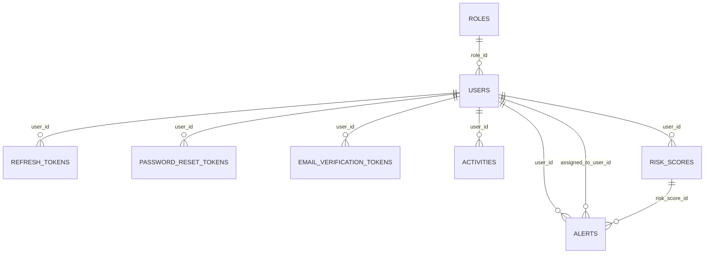
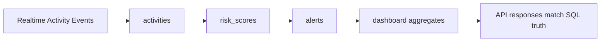

# Database Engineer Guide: Real-Time Data Testing for SentinelX

## 1. Purpose

This document is a practical runbook for database engineers validating SentinelX with real-time or near-real-time data feeds.

It focuses on:

- data correctness under production-like write/read patterns,
- query and index behavior under sustained load,
- migration and schema safety,
- operational readiness for go-live.

## 2. System Context You Are Testing

SentinelX is a Spring Boot modular monolith using PostgreSQL with Flyway migrations and Hibernate schema validation.

Key runtime characteristics:

- No message queue in the current architecture (writes are synchronous through API and service layer).
- Security and auth token state are persisted in relational tables.
- Dashboard endpoints rely on aggregate queries and time-window calculations.

Primary data flow tested in this guide:

1. Activity writes arrive.
2. Risk scores are calculated and persisted.
3. Alerts are generated and transitioned.
4. Dashboard aggregations read across recent and historical datasets.

## 3. Required Environment Baseline

## 3.1 PostgreSQL and App Settings

- PostgreSQL 15+
- Flyway migrations enabled
- spring.jpa.hibernate.ddl-auto=validate
- Production-style DB credentials via environment variables

Relevant backend config:

- DB_URL
- DB_USERNAME
- DB_PASSWORD
- SERVER_PORT
- JWT_SECRET
- JWT_EXPIRATION_MS
- JWT_REFRESH_EXPIRATION_MS

## 3.2 Data Volumes for Real-Time Validation

At minimum, run tests with:

- users: 10k+
- activities: 1M+
- risk_scores: 500k+
- alerts: 100k+
- refresh_tokens: realistic active session count

If your target production scale is higher, apply a 1.5x-2x stress multiplier.

## 4. Core Tables and Real-Time Risk Areas

## 4.1 High-Churn Tables

- activities
- risk_scores
- alerts
- refresh_tokens

## 4.2 High-Integrity Tables

- users
- roles
- email_verification_tokens
- password_reset_tokens

## 4.3 Key Foreign-Key Relationships to Validate



## 5. Test Phases for Real-Time Data

## 5.1 Phase A: Migration and Schema Integrity

1. Run migrations from clean database.
2. Verify all V1-V9 objects exist.
3. Confirm constraints, indexes, and nullable semantics match entity mappings.
4. Confirm app startup succeeds with ddl-auto=validate.

Validation SQL examples:

```sql
select version, description, success
from flyway_schema_history
order by installed_rank;

select table_name
from information_schema.tables
where table_schema = 'public'
order by table_name;
```

## 5.2 Phase B: Seed and Identity Consistency

Seed process must guarantee ADMIN, ANALYST, EMPLOYEE roles.

Validation SQL:

```sql
select name, count(*)
from roles
group by name
order by name;
```

Expected outcome:

- exactly one row per default role in stable environments,
- no duplicate role semantics.

## 5.3 Phase C: Write Path Real-Time Load Validation

Generate concurrent writes for:

- activity inserts,
- risk score inserts,
- alert lifecycle updates,
- refresh token create/rotate/revoke operations.

Track:

- insert/update latency p95 and p99,
- lock waits,
- deadlocks,
- transaction rollback rate.

## 5.4 Phase D: Read Path and Aggregate Stability

Validate paged read behavior under concurrent writes for repository query patterns:

- ActivityRepository findAllByUser/findAllByUserId/findAllByEntityType
- AlertRepository grouped status and severity counts
- RiskScoreRepository latest-per-user average and weekly trend queries

Acceptance target:

- predictable latency under concurrent write pressure,
- no severe plan regressions,
- no lock contention causing endpoint timeouts.

## 6. Query and Index Validation Checklist

## 6.1 Confirm Existing Index Usage

Critical index families from migrations:

- users(role_id), users(status)
- token lookup indexes by token and user_id
- activities(user_id, entity_type, created_at)
- risk_scores(user_id, calculated_at)
- alerts(user_id, status, risk_score_id, assigned_to_user_id)

Use EXPLAIN ANALYZE for high-traffic queries.

Example:

```sql
explain analyze
select *
from activities
where user_id = 12345
order by created_at desc
limit 50;
```

## 6.2 Plan-Drift Watchpoints

Watch for:

- seq scan on high-volume activity/alert tables where index scan is expected,
- sort spill to disk on paged reads,
- high-cost grouped aggregates without adequate statistics.

Mitigation:

- analyze frequency tuning,
- targeted index refinement,
- query-level optimization with backend team.

## 7. Data Quality Assertions for Real-Time Runs

Run periodic assertions during load windows.

## 7.1 Referential Integrity Checks

```sql
select count(*) as orphan_activities
from activities a
left join users u on u.id = a.user_id
where u.id is null;

select count(*) as orphan_alert_risk_links
from alerts a
left join risk_scores r on r.id = a.risk_score_id
where a.risk_score_id is not null and r.id is null;
```

Expected: zero rows violating integrity.

## 7.2 Token State Sanity

```sql
select
  count(*) filter (where revoked = false) as active_tokens,
  count(*) filter (where revoked = true) as revoked_tokens
from refresh_tokens;
```

Check for unexpected growth of active tokens per user after repeated refresh cycles.

## 7.3 Alert Lifecycle Sanity

```sql
select status, count(*)
from alerts
group by status
order by status;
```

Investigate anomalies such as unresolved spikes without corresponding risk activity patterns.

## 8. End-to-End Real-Time Scenario Validation

Use this scenario for production-like confidence:

1. Ingest burst of activities for mixed user populations.
2. Confirm risk_scores growth and score distribution.
3. Confirm alerts generated above configured thresholds.
4. Transition subset of alerts through acknowledge and resolve flows.
5. Validate dashboard aggregate endpoints against direct SQL counts.

Reference validation path:



## 9. Performance and Capacity Acceptance Criteria

Define target thresholds before test run:

- API backed query p95 and p99 latency targets
- Maximum acceptable lock wait duration
- CPU and memory guardrails for PostgreSQL
- Maximum tolerated replication lag if read replicas are used

Recommended minimum acceptance for pre-prod signoff:

- zero migration failures,
- zero referential integrity violations,
- zero critical deadlocks under expected load,
- stable aggregate query latency at target concurrency.

## 10. Operational Safety and Rollback Plan

## 10.1 Before Test Window

- full database backup snapshot
- migration version checkpoint
- observability dashboards ready (connections, locks, slow queries)

## 10.2 During Test Window

- monitor lock graph and long-running transactions
- capture top N slow statements
- record error rates from backend endpoints

## 10.3 Rollback Conditions

Stop test and roll back if any of the following occur:

- sustained deadlocks affecting user-facing flows,
- schema mismatch errors with ddl-auto=validate,
- data corruption indicators (orphans, invalid lifecycle states),
- severe query plan regression causing SLA breach.

## 11. Collaboration Protocol with Backend Team

Open a backend issue with:

- exact SQL/query plan evidence,
- table/index involved,
- before vs after metrics,
- reproducible load profile,
- proposed remediation.

Backend should respond with:

- repository/query code path confirmation,
- required migration/index updates,
- test additions to prevent recurrence.

## 12. Final Signoff Template

Use this checklist at the end of real-time validation.

- migrations V1-V9 validated
- role seeding verified
- referential integrity checks clean
- high-churn table writes stable under load
- aggregate queries stable under concurrency
- token lifecycle sanity confirmed
- alert lifecycle data consistency confirmed
- dashboard SQL vs API parity verified
- rollback and backup drills completed

If all boxes are checked, database readiness for real-time SentinelX testing is acceptable.
