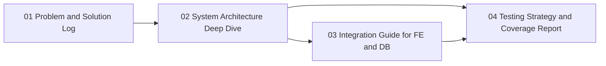

# Engineering Documentation Index

This folder contains deep technical documentation for engineers who need to understand, extend, and operate the SentinelX backend.

## Documents

1. [Problem and Solution Log](01-problem-solution-log.md)
2. [System Architecture Deep Dive](02-system-architecture-deep-dive.md)
3. [Integration Guide for Frontend and Database Engineers](03-integration-guide-for-fe-and-db.md)
4. [Testing Strategy and Coverage Report](04-testing-strategy-and-coverage-report.md)
5. [Database Engineer Real-Time Data Testing Guide](05-database-engineer-real-time-data-testing-guide.md)

## Recommended Reading Order

1. Start with the problem and solution log to understand historical engineering decisions.
2. Read the architecture deep dive for structural and runtime understanding.
3. Use the integration guide for day-to-day frontend and database collaboration.
4. Review the testing report for confidence level and regression strategy.
5. Use the database real-time testing guide when validating production-like data behavior.

## Documentation Relationship Map

## When to Use Which Doc

- Use [01-problem-solution-log.md](01-problem-solution-log.md) when evaluating trade-offs or revisiting prior choices.
- Use [02-system-architecture-deep-dive.md](02-system-architecture-deep-dive.md) when implementing or refactoring core modules.
- Use [03-integration-guide-for-fe-and-db.md](03-integration-guide-for-fe-and-db.md) when onboarding frontend and database contributors.
- Use [04-testing-strategy-and-coverage-report.md](04-testing-strategy-and-coverage-report.md) when assessing release confidence and test gaps.
- Use [05-database-engineer-real-time-data-testing-guide.md](05-database-engineer-real-time-data-testing-guide.md) when running high-volume and real-time database validation.